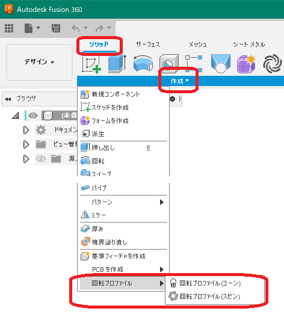

# ***Fusion360 SpunProfile***

これは、オートデスクソフトウェア「Fusion360」のアドインです。

回転プロファイルを作成します。

[こちら](https://forums.autodesk.com/t5/fusion-360-ri-ben-yu/xuan-pan-yongno-hui-zhuanpurofairuwosuketchitoshite-qu-deshitai/td-p/11616061)の取り組みです。

---

## **インストール**:

インストールする際は、zip ファイルをダウンロード/展開後 "SpunProfile" フォルダを **アドイン** として登録してください。

アドインの登録は、[こちら](https://kantoku.hatenablog.com/entry/2021/02/15/161734)の手順に従ってください。

---

## **使用法**:

アドイン起動後は、デザインの "SPUNPROFILE" タブが追加され "作成" 内に "回転プロファイル(コーン)" コマンドが追加されます。

クリックする事でダイアログが表示されます。

+ ボディ：処理対象のソリッドボディを指定します。
+ 回転軸：構築軸・円筒面・円錐面・直線のエッジが選択可能です。
+ ピッチ：回転軸に沿って何mmピッチで断面を求めるか指定します。
  + 0.001mm以上を指定してください。
  + 小さい値にすると、より細かい処理を行いますが、処理時間が長くなります。

---

#### 処理結果 :

新たなコンポーネントが作成され、回転プロパティとなるボディが作成されます。

+ コンポーネント名は "SpunProfile_pitch_{指定ピッチ}" となります。

---

## **注意・制限** :

+ 現在、本コマンドは不完全です。

---

## **TODO** :

+ ボディでは無く、スケッチにてプロファイルを出力する。

---

## **アクション** :

以下の環境で確認しています。

- Fusion360 Ver2.0.15050
- Windows10 64bit Pro , Home

---

## **ライセンス**:
- MIT

---

## **謝辞** :

- [日本語フォーラム](https://forums.autodesk.com/t5/fusion-360-ri-ben-yu/bd-p/707)の皆さん、ありがとう。
