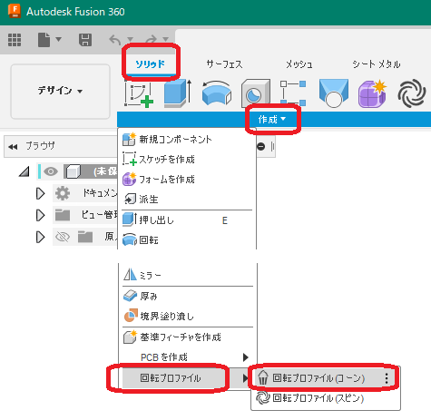
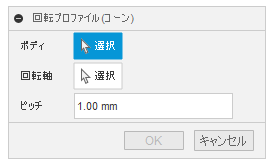
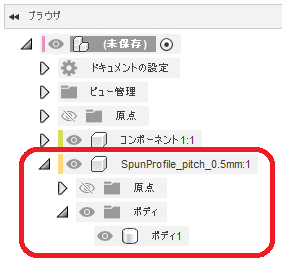

# ***回転プロファイル(コーン)***

簡易的な回転プロファイルのボディを作成します。

---

## **使用法**:

アドイン起動後は、デザインの "ソリッド" タブが追加され "作成" 内に "回転プロファイル" - "回転プロファイル(コーン)" コマンドが追加されます。

クリックする事でダイアログが表示されます。

+ ボディ：処理対象のソリッドボディを指定します。
+ 回転軸：構築軸・円筒面・円錐面・直線のエッジが選択可能です。
+ ピッチ：回転軸に沿って何mmピッチで断面を求めるか指定します。
  + 0.001mm以上を指定してください。
  + 小さい値にすると、より細かい処理を行いますが、処理時間が長くなります。

---

## **処理結果** :

新たなコンポーネントが作成され、回転プロパティとなるボディが作成されます。

+ コンポーネント名は "SpunProfile_pitch_{指定ピッチ}" となります。

---

## **注意・制限** :

+ 現在、本コマンドは不完全です。

---

## **アクション** :

以下の環境で確認しています。

- Fusion360 Ver2.0.15050
- Windows10 64bit Pro , Home

---

## **ライセンス**:
- MIT

---

## **謝辞** :

- [日本語フォーラム](https://forums.autodesk.com/t5/fusion-360-ri-ben-yu/bd-p/707)の皆さん、ありがとう。
