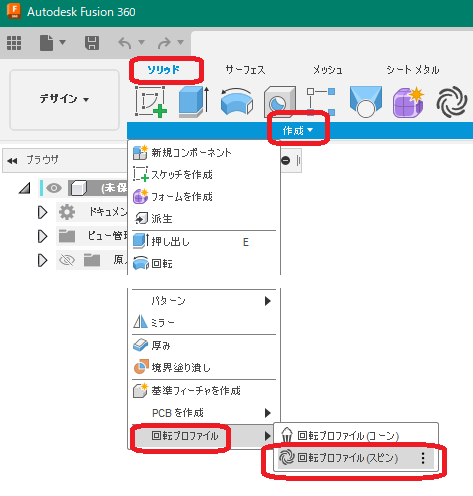

# ***回転プロファイル(スピン)***

回転プロファイルをサーフェスとスケッチで作成します。

---

## **使用法** :

アドイン起動後は、デザインの "ソリッド" タブが追加され "作成" 内に "回転プロファイル" - "回転プロファイル(スピン)" コマンドが追加されます。

クリックする事でダイアログが表示されます。

+ ボディ：処理対象のソリッドボディを指定します。
+ 回転軸：構築軸・円筒面・円錐面・直線のエッジが選択可能です。
+ トレランス：ボディを回転させてプロファイルを取得します。
  + 高：1度毎に回転させます。
  + 中：2度毎に回転させます。
  + 低：5度毎に回転させます。
+ アニメーションを表示する：作業状態を表示させます。但し実行時間が大幅に長くなります。（約3倍）

---

## **処理結果** :

新たなコンポーネントが作成され、回転プロパティとなるボディが作成されます。

+ コンポーネント名は "SpunProfile_Angle_{回転角度}" となります。
 + プロファイルとなるサーフェス・構築平面・スケッチが作成されます。
 + 出来上がったスケッチは、サーフェスのエッジをプロジェクトした状態となっています。

---

## **注意・制限** :

+ 現在、本コマンドは不完全です。

---

## **アクション** :

以下の環境で確認しています。

- Fusion360 Ver2.0.15291
- Windows10 64bit Pro , Home

---

## **ライセンス**:
- MIT

---

## **謝辞** :

- [日本語フォーラム](https://forums.autodesk.com/t5/fusion-360-ri-ben-yu/bd-p/707)の皆さん、ありがとう。
